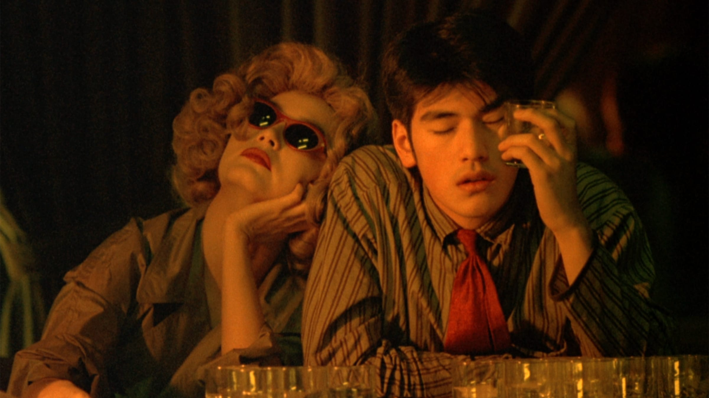

# She Hasn't Called Yet

<iframe style="border-radius:12px" src="https://open.spotify.com/embed/track/6kpNsMaTHS55hHPKJAagsT?utm_source=generator" width="100%" height="352" frameBorder="0" allowfullscreen="" allow="autoplay; clipboard-write; encrypted-media; fullscreen; picture-in-picture" loading="lazy"></iframe>

She hasn't texted back in two days. Why avoidance? I don't feel comfortable talking about it here either. Don't want anyone to find this journal. Why am I broadcasting it online then? I want the audience, but I don't want the audience to know me.

It is easier to lament onto these thoughts than to work on anything meaningful. No one appreciates my work. 

education system does not understand how i approach the systems in the real world. the real world does not apprecaite how i interface with everything around me. my body does not appreciate how i try. my brain does not appreciate everything around me (as seen by the lack of gratitude in the previous sentence). but is gratitude innate to one? can i earn this englihtenment and become better. M said today that my life is not now and then and later but just continous. i cannot magically change. i must change now. not later. i did not gym today. ate tims. will get villified for that. will a kid get drone striked by me fried chicken wrap? rip vro.

man i need to stop chasing for attention. friendly or non friendly any kind of attention seeking anything to stop me from refocusing on myself. ill delete instagram again. i must pass my courses. a matter of integrity.